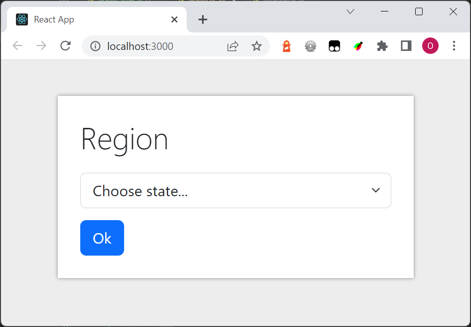
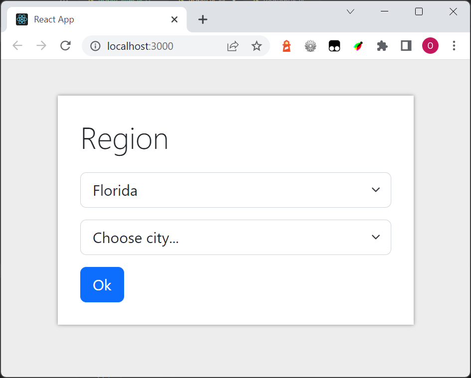
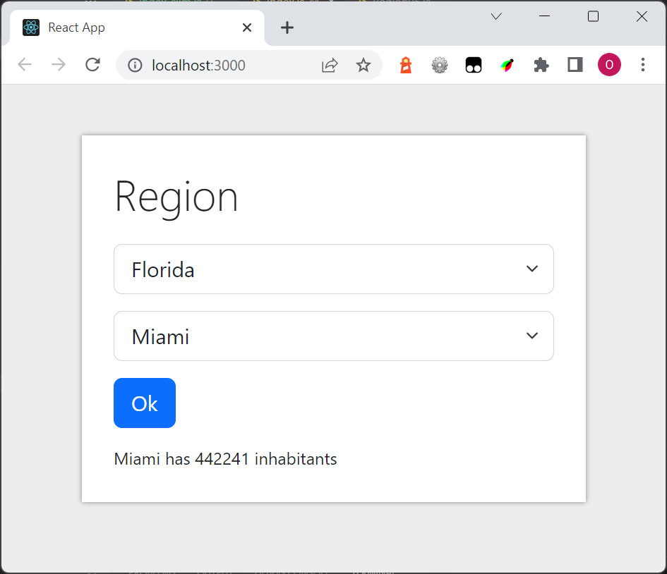
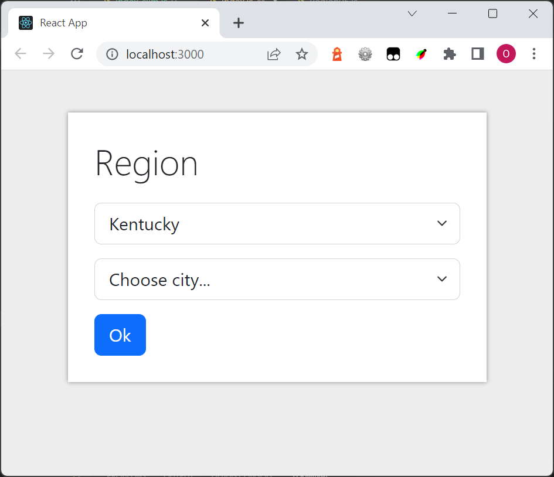

# Region exercise

At start, show a selectbox with some states e.g California, Florida, Kentucky and Texas:

If the user choose a state display some cities in that state in the second selectbox:

If the user choose a city display number of inhabitants:

The user has here changed state to Kentucky:

If **Choose state...** is selected, hide the second selectbox

