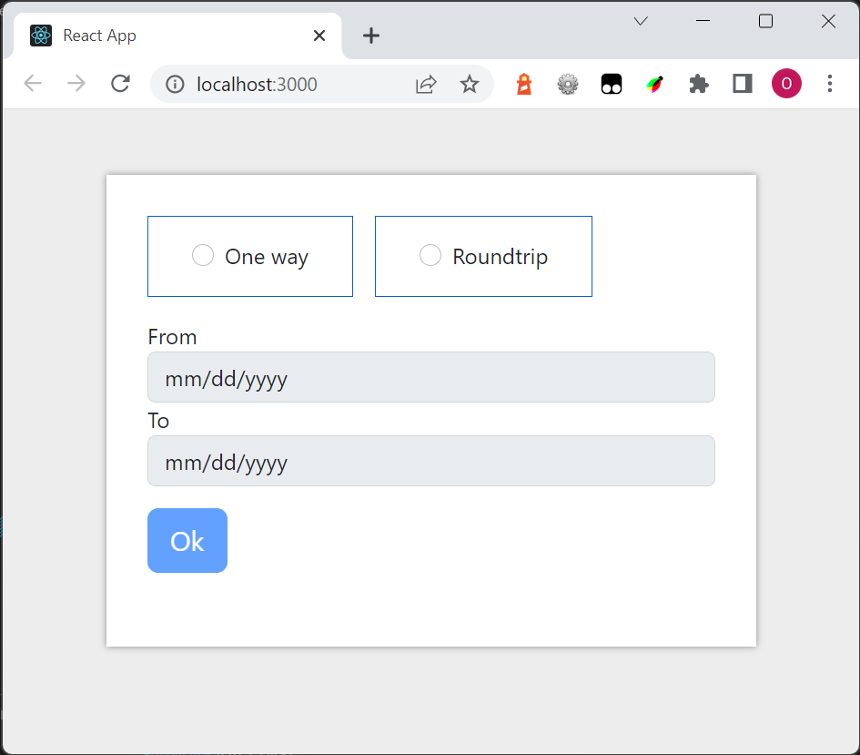
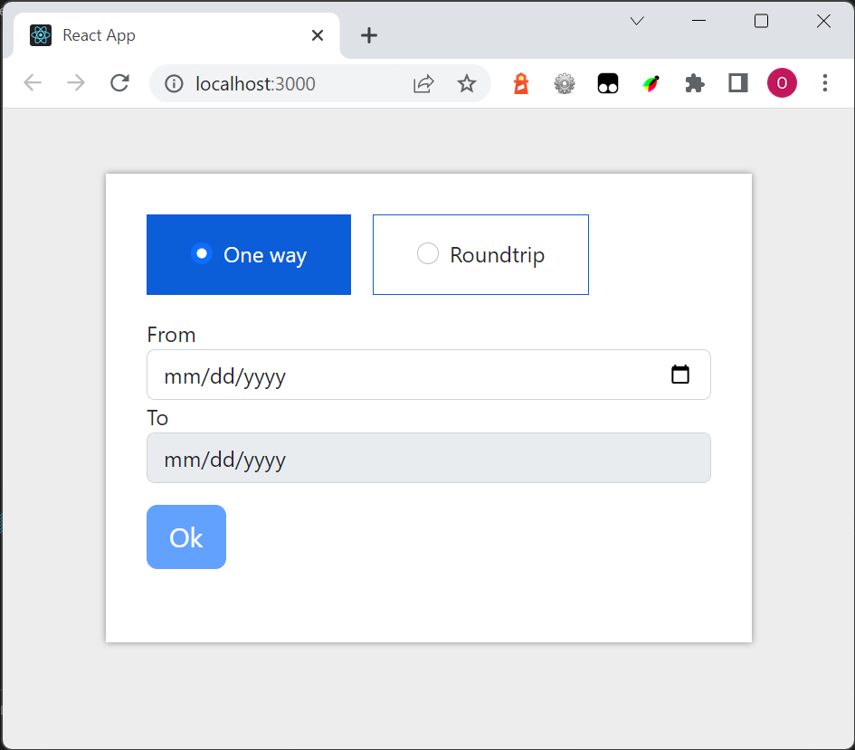
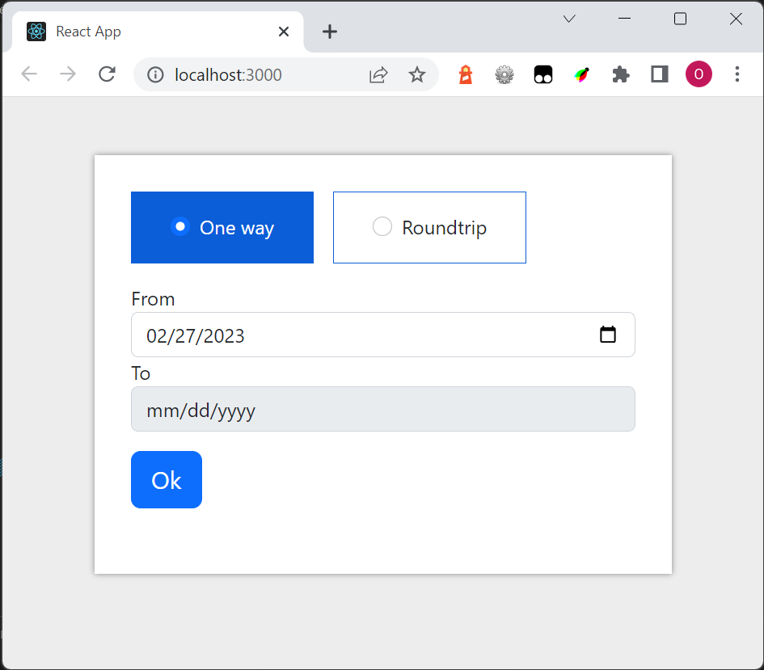
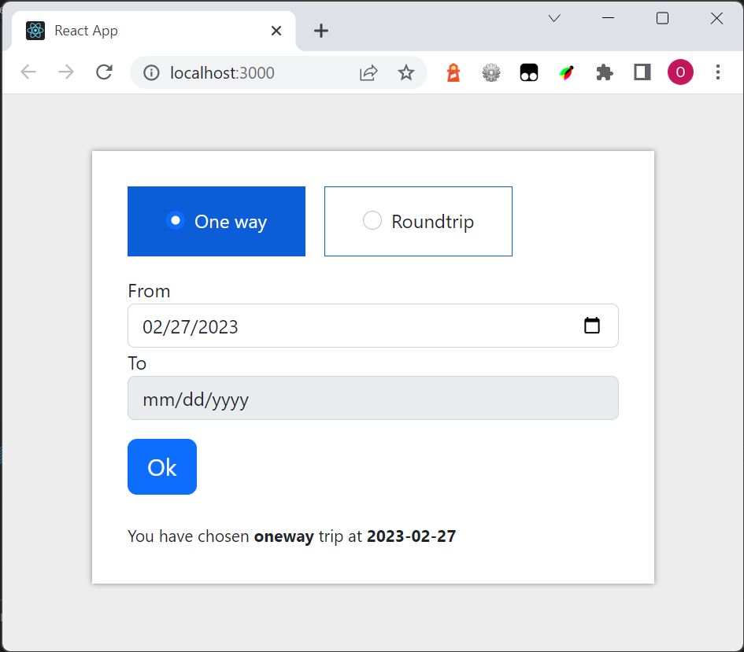
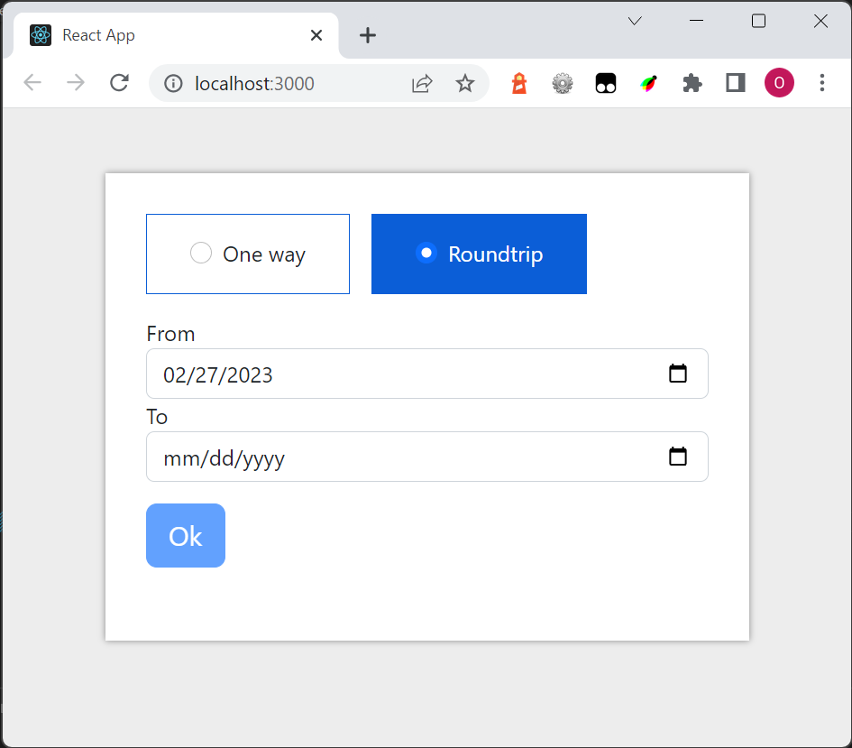
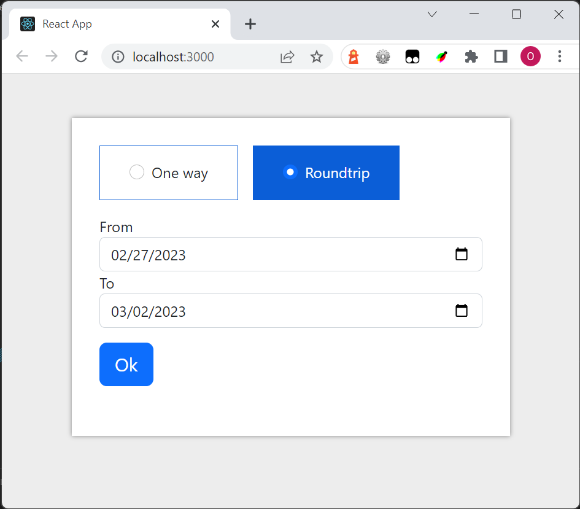
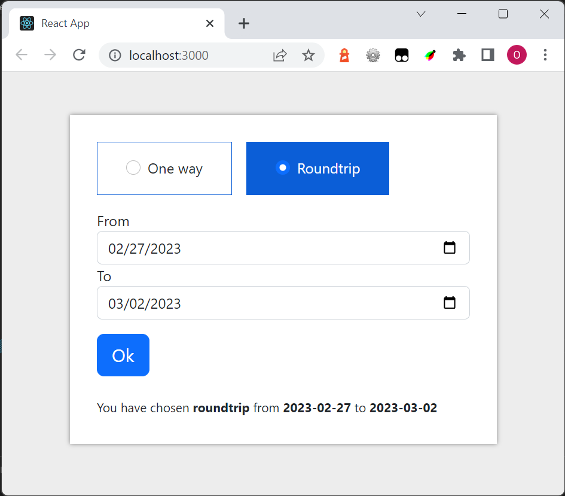

# Train exercise

The user enters the site:

One way is chosen:

A date is entered. Now the form is valid so the button is enabled:

The button is clicked

Click on *Roundtrip*

The second datepicker is entered.  Now the form is valid so the button is enabled:

The button is clicked

The user clicked on *One way*

